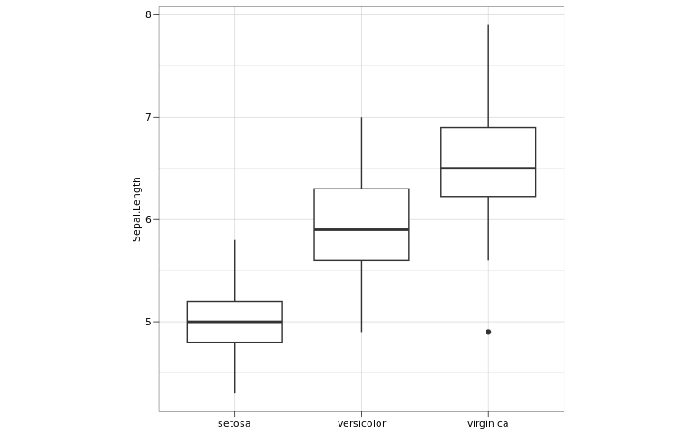

# catplot: Capable And Tity Plot 

[](https://github.com/zerostwo/catplot)
[](https://app.codecov.io/gh/zerostwo/catplot?branch=main)
[](https://lifecycle.r-lib.org/articles/stages.html)

<!-- README.md is generated from README.Rmd. Please edit that file -->

## 🤪 Overview

`catplot` is a capable and tity data visualization tool and maintained
by [Songqi Duan](https://songqi.online).

## 📦 Installation

Install the latest version from
[GitHub](https://github.com/zerostwo/catplot) as follow:

``` r
if (!require(devtools)) install.packages("devtools")
devtools::install_github("zerostwo/catplot")
```

## 🕹️ Usage

``` r
library(catplot)
library(ggplot2)

data("iris")
p <- ggplot(
  data = iris,
  aes(
    x = Species,
    y = Sepal.Length
  )
) +
  geom_boxplot() +
  theme_cat(
    aspect_ratio = 1,
    show_panel_grid = "both",
    show_title = "y"
  )
p
```



## 🧩 Code of Conduct

Please note that the catplot project is released with a [Contributor
Code of
Conduct](https://contributor-covenant.org/version/2/1/CODE_OF_CONDUCT.html).
By contributing to this project, you agree to abide by its terms.
